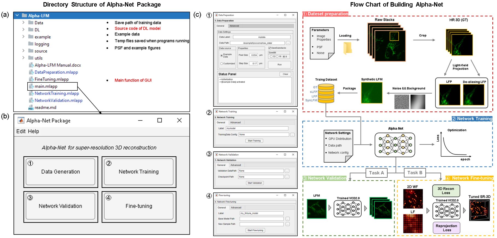

# Alpha-LFM Software
This software accompanies the paper:
\
**Sustained 3D super-resolution imaging of subcellular dynamics using adaptive-learning physics-aware light-field microscopy** ( ***Unpublished*** )

# Contents
- [Requirements](#Requirements)
- [Usage](#Usage)
- [Citation](#Citation)
- [Contact](#Contact)
- [ToDo](#ToDo)
# Requirements

- System requirements
```
· Windows 10. Linux should be able to run the code but the code has been only tested on Windows 10 so far.
· Python 3.8.8 
· CUDA 11.1 and cuDNN 8.2.0
· Graphics: NVIDIA RTX 3090, or better
· Memeory: > 128 GB 
· Hard Drive: ~50GB free space (SSD recommended)
```
- Running environment requirements 
```
Matlab-based GUI requirments:
· Matlab 2022b (or later version)
· Parallel Computing Toolbox and Image Processing Toolbox

Deep-learning model requirments:
- python=3.8.8
- tensorflow-1.15.4+nv-cp38-cp38-win_amd64.whl
- easydict==1.9
- protobuf==3.20.3
- scipy==1.6.2
- scikit-image==0.18.1
- numpy==1.18.3
- matplotlib==3.4.1
- mat73==0.59
```
**More details seen in Section 2:Running environment installation of [Alpha-LFM manual](/Alpha-LFM%20Manual.pdf)**


# Usage
### Workflow of Alpha-LFM software
* Tools under this repository are used to generate training data and build physics-aware network for 3D super-resolution reconstruction in LFM. 
We provide a user-friendly GUI package for fast network construction, which consists of 

  * ***'main.mlapp***: *The main function of Alpha-LFM GUI which includes:*
  	* *‘DataPreparation.mlapp’*：*The sub-function for dataset pre-processing*
	* *‘NetworkTraining.mlapp’*：*The sub-function for network training*
	* *‘NetworkValidation.mlapp’*：*The sub-function for network validation*
	* *‘FineTuning.mlapp’*：*The sub-function for network fine-tuning*
  * ***Data***: *Store the processed data (e.g.training pairs)*
  * ***DL***: *The source code of alpha-net  (The trained model will be automatically saved at its sub-folders)*
  * ***source***: *Light-field PSF matrix and example figures*
  * utils: *Sub-functions of Matlab-based GUI*
  
* The workflow of this GUI is composed of 4 components:
  ① Dataset generation ② Network training ③ Network validation ④ Network fine-tuning.
 \
***Note: The detailed explanation of these components and corresponding operation process are all included in the [Alpha-LFM manual](/Alpha-LFM%20Manual.pdf)***
  \
  \


### Model inference for quick validation
   * After running environment installation (seen in Section 2,[Alpha-LFM manual](/Alpha-LFM%20Manual.pdf)), users can fast implement the [trained models](/DL/checkpoint) on our provided [validation data](/example/validation_data).
     The step-by-step illustration of this process are detailed in Section 3.3, "Quick start guide",[Alpha-LFM manual](/Alpha-LFM%20Manual.pdf). The reconstruction results of example data are available at [Google Drive](https://drive.google.com/file/d/12gmTYRYSmYBnTj5Ha90yrMZVrBdFwLsv/view?usp=sharing).

# Citation
If you use this code and relevant data, please cite the corresponding paper where original methods appeared: 
\
Sustained 3D super-resolution imaging of subcellular dynamics using adaptive-learning physics-aware light-field microscopy. 

# Contact
Correspondence Should you have any questions regarding this code and the corresponding results, please contact Lanxin Zhu (zhulanxin1@hust.edu.cn)

# ToDo:
- Upload more training example
- Rewrite the Python data-generation module to enhance its usability across a broader range of applications 
